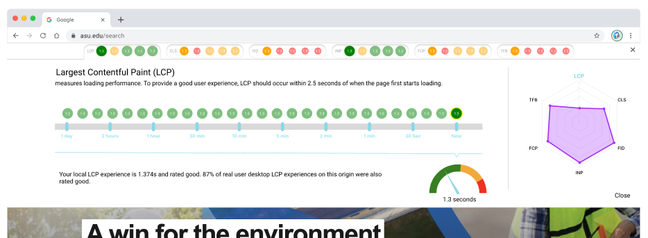

## WebVitals+ Browser Extension

### Overview

WebVitals+ is a Chrome browser extension designed to enhance the developer experience by providing real-time insights
into web vitals metrics directly within your browser. This tool offers developers and website owners immediate feedback
on performance improvements and potential issues affecting their sites' usability.




### Install/Starting

To get started with WebVitals+ Browser Extension, you'll need to install docker and Node.js on your machine.

> Install Docker/Docker-Compose: [https://docs.docker.com/compose/install/](https://docs.docker.com/compose/install/)

> Install Node.js: [https://nodejs.org/en/download/](https://nodejs.org/en/download/)

After installing the local environment follow these steps to clone the project and run both the server and client
components:

#### Clone the Repository

1. Open a terminal or command prompt.
2. Clone the repository to your local machine:
    ```
    git clone https://github.com/jethayer/WebVitalsPlus.git
    ```
3. Navigate to the project directory:
    ```
    cd WebVitalsPlus
    ```

#### Configure the Server

1. Navigate to the server directory:
    ```
    cd server
    ```
2. Rename the `.env.local.dist` to `.env.local`
3. Open the new `.env.local` file and enter the `GPT_TOKEN` and `CRUX_TOKEN` values
    - `GPT_TOKEN` is the ChatGPT API key.
    - `CRUX_TOKEN` is the Google CrUx API key.
4. Navigate back to the root directory:
    ```
    cd ..
    ```

#### Start the Server and App

1. From the root, install the required packages by running:
    ```
    npm install
    ```
2. From the root, start the server and app by running:
    ```
    npm run start
    ```

After starting, the server will be running at `http://localhost:3001` and the client part of the WebVitals+ Browser
Extension will be running and accessible in a newly opened chrome app.
